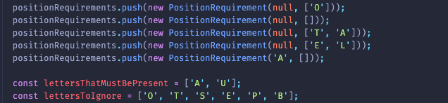
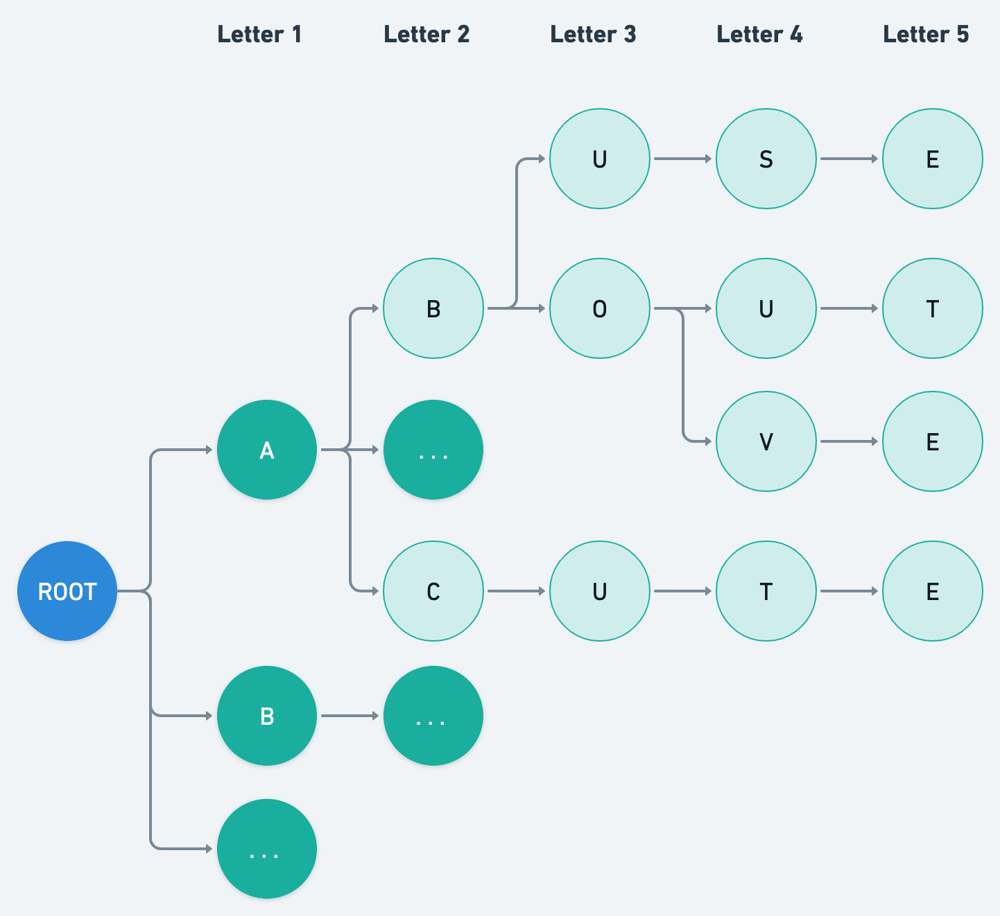

# Wordle/Term.ooo helper

Helps out with the Wordle game

## How to use

### Running it

```shell
npm install
npm start
```

And it will output something like this:

`[ 'CURIA', 'FAUNA', 'VACUA', 'VULVA' ]`

based on the hardcoded requirements found  [here](src/requirements/builder.ts).

Consider the following static example:



It looks for words that:

- Must contain the letters `A` and `U` in it.
- Do not contain the following letters: `O, T, S, E, P, B`
- And follow specific rules for specific positions:
  - 1: Is not an `O`
  - 2: Any letter
  - 3: Is not `T`, `A`
  - 4: Is not `E`, `L`
  - 5: Is an `A`

And it will order the list of results by the number of different letters present in the word.

#### Changing word requirements

*FOR NOW*: go to the [requirements builder](src/requirements/builder.ts) and change the hardcoded values, the next step is to setup a web server and expose an endpoint that expects the requirements in a json format.

## How it works

It follows the steps:

1. Loads the list of valid words ([static/en-us.txt](static/en-us.txt) or  [static/pt-br.txt](static/pt-br.txt))
2. Uses the words to create a search tree/graph structed that faciliates the matching of requirements later.
3. Navigates the tree from root to leaf, checking if each next node satisfies the requirements, in case it gets to the leaf node (length 5) and all requirements are still met, it adds the word to the list of possible solutions.
4. Sorts the result using some criteria that favors mistakes that will teach you more about the word.
5. Returns/logs the list.

### The tree



## Next steps

- [ ] Setup a web server and expose an endpoint that accepts a JSON with requirements and calculates the suggestion list - [issue](https://github.com/phillipe-moreira/wordle/issues/2).
- [ ] Implement more clever ways to sort the result - [issue](https://github.com/phillipe-moreira/wordle/issues/9).
- [ ] Optimize the algorithm.
